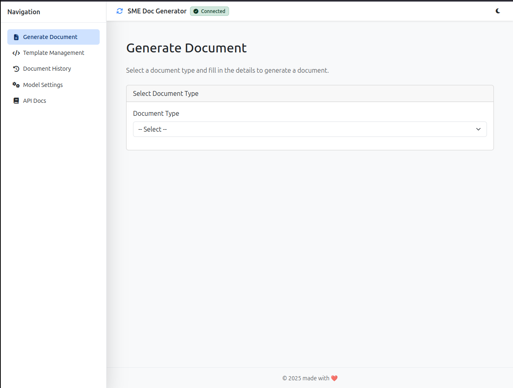

# SME Document Generator (sme-doc-generator-llm)

_A full-stack AI-powered document generation tool tailored for African SMEs._

---

## Table of Contents

1. [Overview](#overview)
2. [Features](#features)
3. [Demo & Screenshots](#demo--screenshots)
   - [GenerateDocView](#generatedocview)
   - [TemplateManagementView](#templatemanagementview)
   - [ModelSettingsView](#modelsettingsview)
   - [DocHistoryView](#dochistoryview)
   - [ApiDocsView](#apidocsview)
4. [Getting Started](#getting-started)
   - [Prerequisites](#prerequisites)
   - [Installation](#installation)
   - [Running Locally](#running-locally)
5. [Configuration](#configuration)
6. [Project Structure](#project-structure)
7. [Technical Stack](#technical-stack)
8. [API Endpoints](#api-endpoints)
9. [Contributing](#contributing)
10. [License](#license)

---

## Overview

This repository implements **SME Document Generator**, a cloud-based application that leverages modern full-stack technologies and AI/LLM integrations to generate business documents (Quotes, Invoices, LPOs, Contracts) on demand. Users can select a document type, fill out dynamic forms, and receive a fully formatted document ready for download.

Key goals:

- Demonstrate full-stack proficiency with Python (FastAPI) and Vue.js.
- Showcase LLM integration using OpenAI’s ChatGPT or compatible free-tier models.
- Provide a responsive, user-friendly interface styled with Bootstrap/Tailwind.
- Illustrate best practices in API design, environment configuration, and Docker-based deployment.

---

## Features

- **Dynamic Document Generation**: Select from multiple document types and fill in context-specific fields.
- **Live Preview**: Instant preview of generated content before download.
- **Download Options**: Export generated documents in PDF/DOCX formats.
- **Template Management**: Admin view to create, edit, activate/deactivate prompt templates.
- **LLM Settings**: Adjust model parameters (model name, temperature, max tokens) and test the connection.
- **History Tracking**: View, filter, and re-download past generation requests.
- **Interactive API Docs**: Embedded Swagger UI for exploring backend endpoints.
- **Docker-Compose Setup**: One-command spin-up for development with FastAPI, Vue.js, and PostgreSQL.

---

## Demo & Screenshots

> _Add your screenshots here to showcase the UI/UX of each page._

### GenerateDocView


_A page where users select a document type, enter details, and generate a document with live preview._

### TemplateManagementView


_Admin interface for listing, editing, and testing prompt templates._

### ModelSettingsView


_View for configuring your LLM (API key, model, temperature, max tokens) and testing connectivity._

### DocHistoryView


_History page showing past document generation requests, with filtering and download actions._

### ApiDocsView


_Embedded Swagger/OpenAPI interface for exploring backend APIs._

---

## Getting Started

### Prerequisites

- Docker & Docker Compose
- Node.js (v16+) & npm/yarn (for local frontend development)
- Python 3.9+ (for virtualenv workflows)

### Installation

1. **Clone the repo**
   ```bash
   git clone https://github.com/eddgachi/sme-doc-generator-llm.git
   cd sme-doc-generator-llm
   ```
2. **Backend setup** (optional if using Docker)
   ```bash
   cd backend
   python -m venv .venv
   source .venv/bin/activate
   pip install -r requirements.txt
   ```

### Running Locally

#### Using Docker Compose (recommended)

```bash
docker-compose up --build
```

- **Backend**: http://localhost:8000
- **Frontend**: http://localhost:5173
- **Swagger UI**: http://localhost:5173/api-docs (embedded) or http://localhost:8000/docs

#### Without Docker

1. **Start PostgreSQL** (or update `DATABASE_URL` in `.env`)
2. **Backend**
   ```bash
   uvicorn app.main:app --reload
   ```
3. **Frontend**
   ```bash
   cd frontend
   npm install
   npm run dev
   ```

---

## Configuration

Application settings are stored in the `application_config` table (via SQLAlchemy) and populated from the default config keys in `backend/app/utils.py`:

| Key                      | Default Value             | Description                                 |
| ------------------------ | ------------------------- | ------------------------------------------- |
| openai_api_key           |                           | Your OpenAI secret key (Bearer)             |
| llm_model                | gpt-3.5-turbo             | Which LLM model to call                     |
| llm_api_base_url         | https://api.openai.com/v1 | Base URL for LLM provider                   |
| llm_temperature          | 0.7                       | Controls creativity of responses            |
| llm_max_tokens           | 1024                      | Maximum tokens in LLM response              |
| default_doc_format       | pdf                       | Document format for downloads (pdf or docx) |
| enable_history           | true                      | Toggle persistence of past queries          |
| history_retention_days   | 30                        | Days to keep query history                  |
| response_timeout_seconds | 30                        | Backend timeout for LLM calls (seconds)     |
| cors_allowed_origins     | \*                        | Comma-separated allowed origins for CORS    |
| retry_on_failure_count   | 2                         | Number of auto-retries on LLM timeout       |

> _Create a `.env` file in `backend/` with the `DATABASE_URL` and `OPENAI_API_KEY`._

---

## Project Structure

```
├── backend/
│   ├── app/
│   │   ├── main.py         # FastAPI app entrypoint
│   │   ├── routes.py       # API endpoints
│   │   ├── schemas.py      # Pydantic models
│   │   ├── services.py     # Business logic (LLM integration, document gen)
│   │   ├── utils.py        # Helpers & default config loader
│   │   ├── session.py      # DB session management
│   │   └── models.py       # SQLAlchemy ORM models
│   ├── alembic/           # DB migrations
│   ├── Dockerfile
│   └── requirements.txt
├── frontend/
│   ├── src/
│   │   ├── views/          # Vue pages (Generate, Templates, Settings, History, API Docs)
│   │   ├── components/     # Reusable Vue components
│   │   └── router/         # Vue Router setup
│   ├── Dockerfile
│   └── package.json
├── docker-compose.yml
└── README.md
```

---

## Technical Stack

### Backend

- **Language & Framework**: Python, FastAPI
- **ORM & Migrations**: SQLAlchemy, Alembic
- **LLM Integration**: OpenAI Chat API (configurable)
- **Database**: PostgreSQL
- **Containerization**: Docker

### Frontend

- **Framework**: Vue.js 3 (Composition API, `<script setup>`)
- **Styling**: Bootstrap
- **Routing**: Vue Router

---

## API Endpoints

| Method | Path                   | Description                          |
| ------ | ---------------------- | ------------------------------------ |
| POST   | `/generate`            | Generate a document via LLM          |
| GET    | `/templates`           | List all prompt templates            |
| PUT    | `/templates/{id}`      | Update a prompt template             |
| POST   | `/templates/{id}/test` | Test a template prompt               |
| GET    | `/settings/llm`        | Fetch current LLM configuration      |
| PUT    | `/settings/llm`        | Update LLM configuration             |
| GET    | `/history/docs`        | Retrieve document generation history |
| GET    | `/docs`                | Swagger UI (FastAPI auto-generated)  |

---

## Contributing

1. Fork the repository
2. Create your feature branch (`git checkout -b feature/XYZ`)
3. Commit your changes (`git commit -m "Add XYZ feature"`)
4. Push to the branch (`git push origin feature/XYZ`)
5. Open a Pull Request

Please adhere to the existing coding conventions and write tests where appropriate.

---

## License

This project is licensed under the [MIT License](LICENSE).
